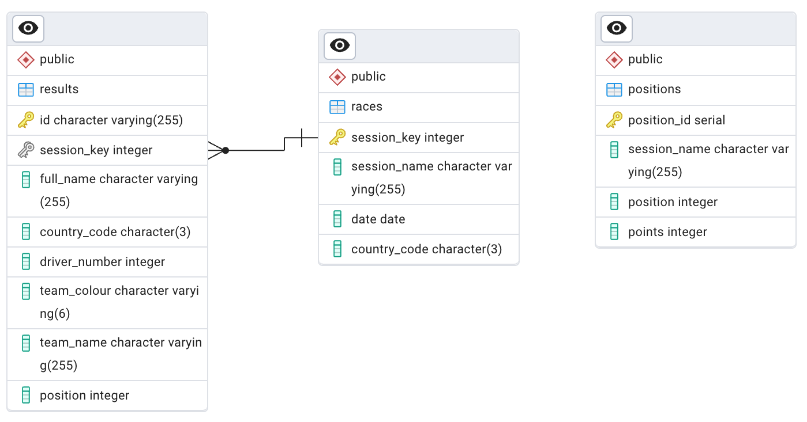

# Week 1
Extract data from [OpenF1 API](https://openf1.org), process data, and stores in a postgres database. The visualization consume the stored data and show the Drivers and Contructors classification for 2025 Formula 1 Season.

## How to use

### Python and Streamlit
* Clone this repo.
* Enter to Week1 directory.
* Create python virtual environment: `python3 -m venv .venv`
* Activate the env.
* Install dependencies: `pip install -r requirements.txt`
* Run the pipeline: `python3 pipeline.py`
* Run the vesualization: `streamlit run visualization.py`

### Postgres Database
* Create tables following the schema:

* Create these views:
    * Points:
        ```sql
        CREATE OR REPLACE VIEW points AS
        SELECT
            r.session_key,
            r.session_name,
            r.country_code AS race_country,
            CASE
                WHEN re.full_name='Andrea Kimi ANTONELLI' THEN 'Kimi ANTONELLI'
                ELSE re.full_name
            END AS full_name,
            re.country_code AS driver_country,
            re.driver_number,
            re.team_colour,
            re.team_name,
            re.position,
            COALESCE(
                (
                    SELECT
                    p.points
                    FROM positions p
                    WHERE r.session_name=p.session_name AND
                        re.position=p.position
                ),
            0
            ) AS "points",
            CASE
                WHEN re.position = 1 and r.session_name = 'Race' THEN true
                ELSE false
            END AS is_victory

        FROM races r
        LEFT JOIN results re ON
            r.session_key = re.session_key
        ORDER BY session_key, re.position;
        ```

    * Drivers Clasification
        ```sql
        CREATE OR REPLACE VIEW drivers_clasification AS
        WITH drivers AS (
            SELECT DISTINCT ON (full_name)
                driver_number AS "number",
                full_name AS Driver,
                driver_country AS nationality,
                team_colour,
                team_name AS team,
                SUM(points) OVER (PARTITION BY full_name) AS points,
                SUM(CASE WHEN is_victory THEN 1 ELSE 0 END) OVER (PARTITION BY full_name) AS victories
            FROM points
            ORDER BY full_name, session_key DESC
        )
        SELECT * FROM drivers ORDER BY points DESC, victories DESC;
        ```
    * Teams Clasification
        ```sql
        CREATE view teams_clasification AS
        SELECT
            team_name AS team,
            team_colour,
            SUM(points) AS points

        FROM points
        GROUP BY team_name, team_colour
        ORDER BY points DESC;
        ```